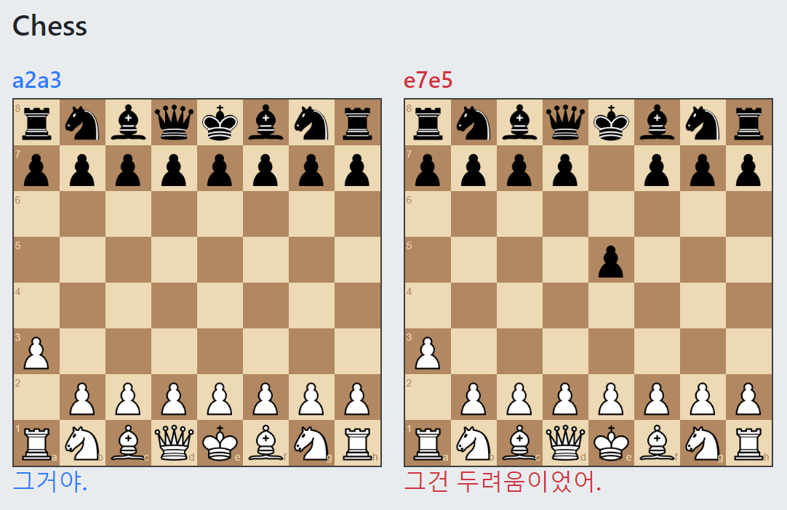
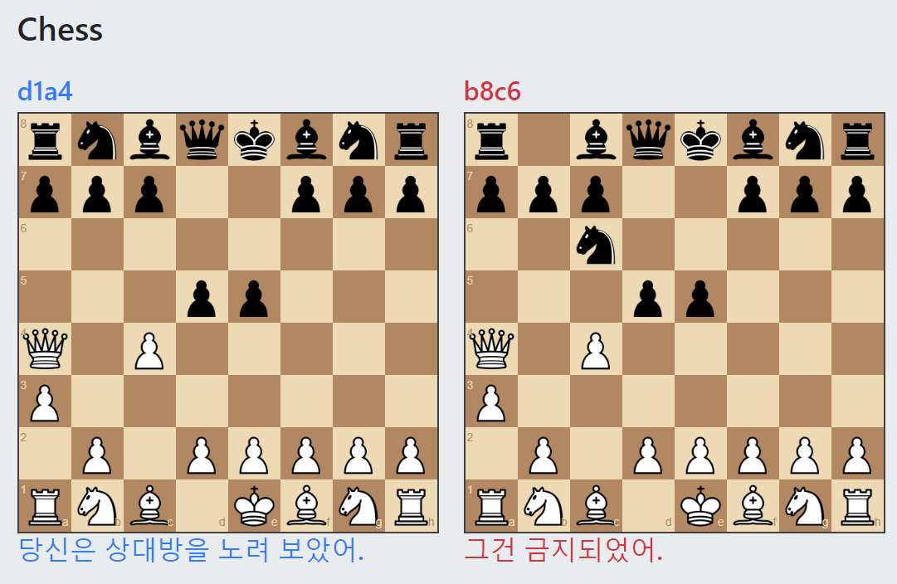

# Chess AI & Annotater

## Structure

model  
- input : Chess board state & Player move  
- output : Annotation of that move  

## Learning

- chess board state : FEN (Forsyth-Edwards notation)  
- player move : SAN (Standard Algebraic Notation)  
- annotation : Word2Vec (with Term Frequency – Inverse Document Frequency analysis)
- annotation data from chess notation sites (gameknot.com, gambitchess.com, angelfire.com)  
- loss : MSE of annotation vector
- network : 3FC / 1CV + 2FC / 2CV + 1FC (fully connected and convolutional)

## Result 

